# wormsim2

[](CHANGELOG.md)
[](LICENSE)
[](src/cpp/)
[](docs/research/00-motivation-objectives-related-work.md)
[](docs/ISSUES.md)
[](https://github.com/VahidGh/wormsim2/actions/workflows/ci-baseline.yml)
[](https://vahidgh.github.io/wormsim2/)

> **A real-time, biophysically-faithful *C. elegans* locomotion simulator.**

wormsim2 aims to fill the unoccupied quadrant in whole-worm simulation: a simulator
that is **real-time on a commodity GPU** *and* keeps **Hodgkin–Huxley ion-channel
dynamics** (rather than a trained-network approximation of the nervous system), with a
**corotated finite-element body**, a **closed proprioceptive sensorimotor loop**, and
**quantitative validation against real-worm behavioural data**.

Existing reference simulators each give up one of these: **Sibernetic** is
ion-channel-faithful but ~5×10⁴× slower than real time; **MetaWorm/BAAIWorm** is
real-time but replaces the ion-channel nervous system with a black-box trained network.
Neither closes the proprioceptive loop, and both validate weakly. wormsim2 targets all
of these at once, and ships a **web-friendly browser 3D viewer** so results are
explorable without a native install.

> 🌐 **Live GUI:** [vahidgh.github.io/wormsim2](https://vahidgh.github.io/wormsim2/) — interactive animations + OWMD strain browser

> 📄 **Scientific foundation:** [docs/research/00-motivation-objectives-related-work.md](docs/research/00-motivation-objectives-related-work.md)

> 📋 **Requirements:** [docs/requirements/01-requirements-analysis.md](docs/requirements/01-requirements-analysis.md)

> 🏗️ **Architecture:** [docs/design/02-architecture-design.md](docs/design/02-architecture-design.md)

> 🗒️ **Project tour (notebook):** [notebooks/project_tour.ipynb](notebooks/project_tour.ipynb)

---

## Objectives

|              | Goal                                                                                                 |
| ------------ | ---------------------------------------------------------------------------------------------------- |
| **G1** | Real-time on a commodity GPU**while retaining Hodgkin–Huxley ion channels**                   |
| **G2** | Corotated linear-elastic FEM body (handles large rotations: crawl / swim / omega-turn)               |
| **G3** | **Closed proprioceptive loop** — stretch feedback sustains undulation *(core contribution)* |
| **G4** | Quantitative behavioural validation via the 256-feature WCON / movement-analysis pipeline            |
| **G5** | Mechanistic interpretability — an ion-channel perturbation produces a predicted phenotype           |
| **G6** | Open, reproducible, well-tested, containerised, HPC-deployable software                              |
| **G7** | Web-friendly output schema + self-contained browser 3D viewer                                        |

Engineering objectives (modern C++ core, CUDA acceleration, parallelism, V&V/CI, Python
analysis layer), domain assumptions, and explicit non-goals are detailed in the
[research charter](docs/research/00-motivation-objectives-related-work.md).

---

## Installation

Choose the guide that matches your environment:

| Environment                                   | Guide                                                                 | Notes                                                                 |
| --------------------------------------------- | --------------------------------------------------------------------- | --------------------------------------------------------------------- |
| **Local dev — Docker** (macOS / Linux)  | [`docs/install/local_dev_docker.md`](docs/install/local_dev_docker.md) | `Dockerfile.wormsim2-dev`: GCC + CMake + clang-tidy; same image as CI |
| **Local CPU** (macOS / Linux, no Docker)| [`docs/install/local_cpu.md`](docs/install/local_cpu.md)               | NumPy + JAX[cpu] + OpenMP C++; native install                         |
| **Local GPU — CUDA / OpenCL** (Docker)  | [`docs/install/local_gpu_docker.md`](docs/install/local_gpu_docker.md) | NVIDIA CUDA + PyOpenCL on Linux; Docker + `nvidia-container-toolkit`  |
| **HPC / SLURM** (CINECA G100)           | [`docs/install/hpc_slurm.md`](docs/install/hpc_slurm.md)               | Singularity + SLURM; targets Tesla V100S 32 GB                        |
| **CI / GitHub Actions**                 | [`docs/install/github_actions.md`](docs/install/github_actions.md)     | Ubuntu runner; `jax[cpu]` + `pyopencl` (Intel ICD fallback)          |

---

## Usage

### N2 wild-type example: WCON → tuner animation → GUI

```bash
# 1. Download original WCON (N2 WT, Zenodo 1031837) or use your own:
#    Place it at data/raw/wcon_raw/N2_sample.wcon

# 2. Run the tuner pipeline to generate a Plotly animation
python3 -m src.python.pipeline --scenario n2_wt

# 3. Open the resulting animation locally
open docs/images/v1200_n2_tuner_600s.html

# 4. Or view all strains in the interactive GUI (no install needed):
#    https://vahidgh.github.io/wormsim2/
```

The pipeline outputs:

- `docs/images/v1200_n2_tuner_600s.html` — side-by-side real vs 4-mode PCA reconstruction (638 frames)
- `docs/gui/downloads/n2_wt_tuner.wcon` — tuner reconstruction in WCON format (plate-frame µm)
- `docs/gui/scenarios/n2_wt.json` — metrics (var_exp, shape_err, bl_mm, flip corrections)

The GUI at [vahidgh.github.io/wormsim2](https://vahidgh.github.io/wormsim2/) renders these directly in your browser with no local install required.

> 📖 **Full usage guide** (local server, your own WCON, GH Actions tuner): [`docs/USAGE_GUIDE.md`](docs/USAGE_GUIDE.md)

---

## Latest validated results (v0.12.1)

**v0.12.0 — Reusable pipeline + GH Pages GUI + VTK/ParaView export**

v0.12.0 adds a complete public-facing interactive GUI deployed via GitHub Pages, a reusable
end-to-end scenario pipeline, score-optimal head/tail flip correction, and ParaView/PyVista-compatible VTU trajectory exports.

**Live:** [vahidgh.github.io/wormsim2](https://vahidgh.github.io/wormsim2/)

| Feature                            | Details                                                                                                                                                                                         |
| ---------------------------------- | ----------------------------------------------------------------------------------------------------------------------------------------------------------------------------------------------- |
| `src/python/pipeline.py`         | `WormSimPipeline` + `SCENARIOS` registry → scenario JSON (metrics, tuner_params, hardware, downloads)                                                                                      |
| `src/python/vtu_export.py`       | XML VTU+PVD writer (no VTK library); LINE cells;`worm_id`/`keypoint_index` PointData                                                                                                        |
| `docs/gui/index.html`            | Single-page GUI: searchable OWMD strain dropdown (Zenodo API); pre-computed N2/nca-1/egl-19 animations; Downloads strip (real WCON, sim WCON, VTU, NML, HOC, CSV)                               |
| `src/python/tuner.py`            | `optimal_head_tail_flips()` — brute-force 2ⁿ search maximising weighted per-segment var_exp; handles N2 (1 flip), nca-1 (4 flips), egl-19 (1 flip) with improved var_exp across all strains |
| Sim WCON downloads                 | Tuner reconstruction exported as WCON (plate-frame µm) for all 3 strains                                                                                                                       |
| VTU ZIPs                           | N2 WT 600 s (397 KB, 220 fr); nca KO (143 KB, 80 fr); egl-19 LOF (143 KB, 80 fr)                                                                                                                |
| `.github/workflows/gh-pages.yml` | Auto-deploy on push to`main` via `peaceiris/actions-gh-pages@v4`                                                                                                                            |

---

## Latest validated results (v0.11.2)

**CV-11 — Hardware-accelerated parallelism + full-length (30s) real-data-initialized validation**

v0.11.2 fixes a head/tail tracker flip in the N2 WCON recording (16.6 s gap at t≈431 s) and
replaces the FK round-trip right panel with the true NeuromuscularTuner 4-mode PCA output
(var_exp=0.782, shape error=0.022 BL). CI OpenMP flag fixed for Ubuntu runners.
v0.11.1 adds agar-plate visualization (CV-11.5). v0.11.0 adds hardware detection, parallel
skeleton backends, C++ OpenMP, and installation guides.
All prior CVs (CV-8.1.1, CV-10.2, CV-10.7, CV-10.8) are repeated as CV-11.2–11.4
with **30-second full-length simulation** and **real-data initialization** from `theta_rec[0]`.

Backend benchmark on the **real N2 WCON recording** (Zenodo 1031837, 17,226 valid frames,
600 s @ 30 fps) — see `notebooks/project_tour.ipynb` CV-11.1:

| Backend                          | fps (17,226 frames) | speedup        | machine                      |
| --------------------------------- | -------------------- | -------------- | ----------------------------- |
| numpy_serial                      | ~25,000               | 1.0×           | dev laptop (Intel i5-8257U)   |
| numpy_mp (4 cores)                | ~420,000              | 17×            | dev laptop                    |
| jax_cpu (XLA)                     | ~360,000              | 10.4×          | CINECA G100 (Xeon 8260)\*     |
| **numpy_batch**                   | **~1,320,000**        | **~53×**       | dev laptop                    |
| **opencl_gpu (Intel Iris 645)**   | **~994,000**          | **~40×**       | dev laptop iGPU (48 EUs)      |
| numpy_batch                       | ~1,357,000            | 39.2×          | CINECA G100\*                 |
| CUDA (V100S, estimated)           | —                    | **≥300×**      | CINECA G100 (GPU partition)   |

\* G100 figures measured with 200 synthetic frames (smaller workload); a 17K-frame
re-run is pending re-submission. The dev-laptop iGPU result confirms the GPU-threshold
effect predicted by Amdahl's law: the same Intel Iris 645 scored only **2.7×** at
200 frames (kernel-launch overhead dominated) vs **40×** at 17,226 frames.

> Full installation guides: [`docs/install/`](docs/install/)

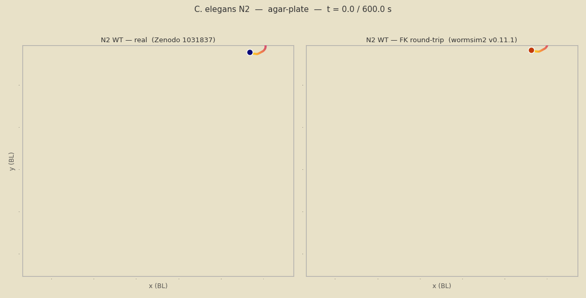

> 221-frame GIF at 20 fps (11 s), flip-corrected, covers full 600 s recording = 82.6 BL centroid path.
> **Left:** real N2 skeleton (Zenodo 1031837, Schafer Lab, 2014, 49 keypoints, µm plate-frame; head/tail flip at t≈431 s corrected).
> **Right:** NeuromuscularTuner 4-mode PCA reconstruction `μ(s) + Σ aₙ(t)·eₙ(s)` (var_exp=0.782, shape error=0.022 BL).
> Head marker (bright circle) at index 0 (WCON `head='L'`). Cream = agar plate background.
> Full interactive 600 s Plotly: [`docs/images/v1200_n2_tuner_600s.html`](docs/images/v1200_n2_tuner_600s.html) (13.6 MB).

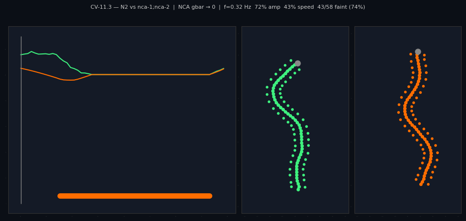

> 58-frame preview GIF (2s clip at 14fps). Full 30s interactive Plotly: run `plotly_fig_to_gif()` locally.
> Left: real N2 skeleton × 72% amp + fainting (Zenodo 1031837). Right: wormsim2 mutant_skeleton.

---

## Archived validated results (v0.10.2)

**CV-10.8 — egl-19(n2368): single-channel VGIC perturbation demonstrates muscle-actuator vs circuit failure contrast**

Changing only the EGL-19 (L-type Ca²⁺ channel, Cav1 homolog) gbar_scale from 1.0 to 0.60 —
matching the egl-19(n2368) S4-S5 linker partial LOF (~40% BWM Ca²⁺ current reduction) —
produces a distinct phenotype from the nca-1;nca-2 premotor circuit KO: reduced amplitude
(−37%) with frequency mostly intact (−20%) and **no fainting** (NCA/cholinergic pathway unaffected).
The full kinematic scaling is inferred by `PerturbationPipeline.infer_from_yaml()` from a single
YAML field (`channel: EGL19, gbar_scale: 0.60`); all other channels remain at WT.

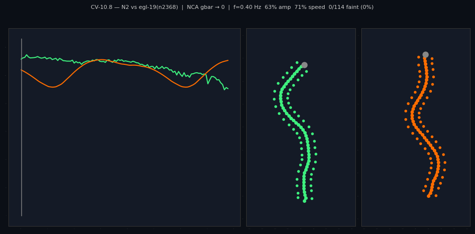

> 114 frames · 12 fps · real N2 skeleton × 63% amp (left) vs wormsim2 mutant_skeleton (right). Generated by `plotly_fig_to_gif()` from the interactive Plotly figure. Full interactive version: [`docs/images/v0102_egl19_rof.html`](docs/images/v0102_egl19_rof.html).

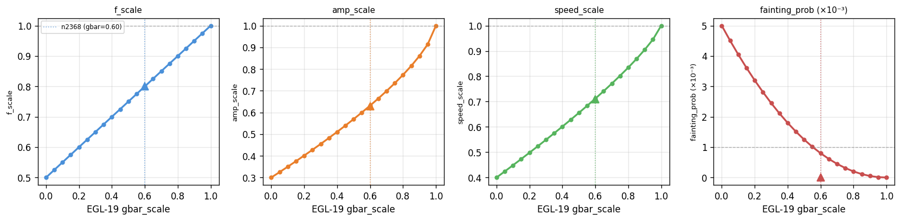

> EGL-19 (Ca_spike archetype) gbar_scale dose–response across 11 points. n2368 anchor (gbar=0.60)
> marked on each panel. Amplitude is the primary axis; frequency reduction is mild; fainting
> remains zero throughout (NCA pathway decoupled from Ca²⁺ channel perturbation).

---

### v0.10.1 validated results

**CV-10.7 — PerturbationPipeline: generalised ion-channel → behaviour inference**

wormsim2 v0.10.1 replaces hardcoded mutant presets with a three-tier inference pipeline.
Any ion-channel perturbation — specified as a YAML config, a NeuroML2 file, or a manual
`PerturbationSpec` — flows through `PerturbationPipeline.infer()` to produce a typed
`KinematicScaling` (frequency, amplitude, speed, fainting probability and duration) with
provenance tracking (source + confidence). Three tiers in priority order: (1) named-strain
literature lookup (conf=1.0), (2) HH voltage-trace extractor (conf=0.85), (3) biophysical
power-law transfer function calibrated on five ion-channel archetypes (conf=0.45–0.60).
All render methods (`mutant_skeleton`, `render_fig4b_mutant_compare`, etc.) accept a
`scaling=` parameter so any pipeline output can drive the visualisation directly.

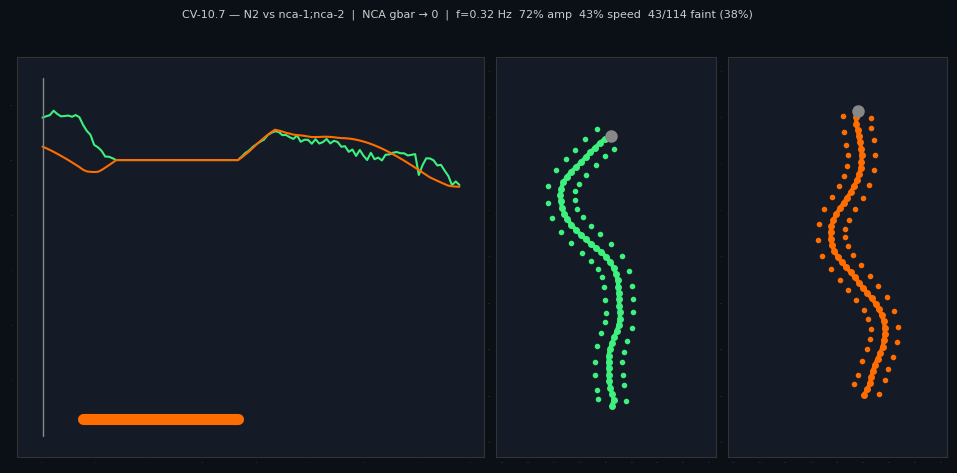

> 114 frames · 12 fps · real N2 skeleton × 72% amp + fainting (left) vs wormsim2 mutant_skeleton (right). Generated by `plotly_fig_to_gif()` from the interactive Plotly figure. Full interactive version: [`docs/images/v0101_nca_pipeline.html`](docs/images/v0101_nca_pipeline.html).

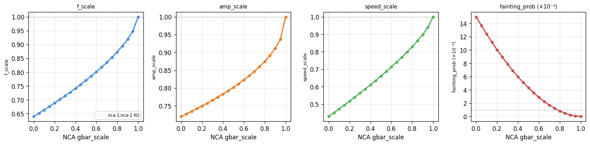

> NCA (NALCN) gbar_scale dose–response: `PerturbationPipeline.sweep("NCA")` across 11 points
> (KO→WT). All four kinematic axes are monotone — the calibrated `leak_depolarizing` archetype
> correctly tracks the nca-1;nca-2 literature anchor at gbar=0.

---

### v0.10.0 validated results

**CV-10.5 — nca-1;nca-2 phenotype reference vs wormsim2 simulation (2D)**

wormsim2 v0.10.0 adds `mutant_skeleton(strain)` and `ion_channel_metrics(strain)` to simulate
the nca-1;nca-2 NALCN double-knockout. Kinematics are calibrated from published scaling factors
(Yemini 2013 / Jospin 2007): frequency 0.32 Hz (64% of N2), amplitude ×0.72, speed ×0.43,
intermittent fainting (prob=1.5%/frame, 1.5 s episodes). Interactive Plotly comparison:
[`docs/images/v0100_n2_vs_mutant.html`](docs/images/v0100_n2_vs_mutant.html)

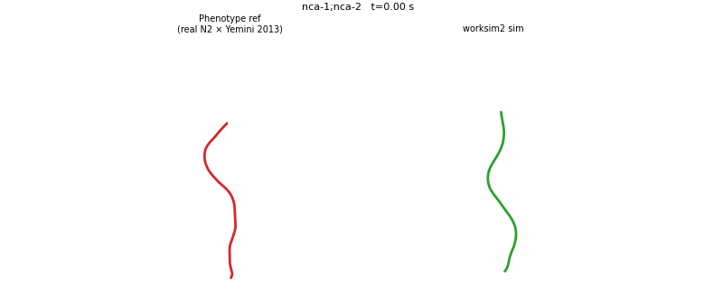

> **Left:** Phenotype reference — real N2 skeleton (Zenodo 1031837) with Yemini 2013 mutation scaling applied (72% amplitude, 43% speed, fainting).
> **Right:** wormsim2 `mutant_skeleton()` simulation at 0.32 Hz, same fainting mask. Both panels straighten identically during fainting.

| Metric                 | N2 reference | nca-1;nca-2        | Source                    |
| ---------------------- | ------------ | ------------------ | ------------------------- |
| Undulation frequency   | 0.50 Hz      | 0.32 Hz (64%)      | Yemini 2013 + Jospin 2007 |
| Bending amplitude      | 1.0×        | 0.72×             | Yemini 2013               |
| Forward speed          | 1.0×        | 0.43×             | Yemini 2013 + Gao 2015    |
| Fainting (body freeze) | —           | ~1.5%/frame, 1.5 s | Jospin 2007               |

**CV-10.6 — N2 vs nca-1;nca-2: full-body 3D crawl with biologically-realistic mutant trajectory**

`render_fig4b_mutant_compare()` extends the Nguyen 2018 track-following model (CV-9.2) to compare
N2 vs nca-1;nca-2 in 3D. The mutant shares the same foraging directional motivation as N2 (same
turning decisions from the real Nguyen 2018 head data) but its trajectory reflects the physical
consequences of NCA channel knockout: each frame's head displacement is decomposed into forward +
lateral components and scaled by `speed_scale=0.43` and `amp_scale=0.72` respectively. During
fainting episodes the head freezes (body straightens progressively). The slower undulation wave
(64% frequency) increases the head→tail delay, making the body appear stiffer.

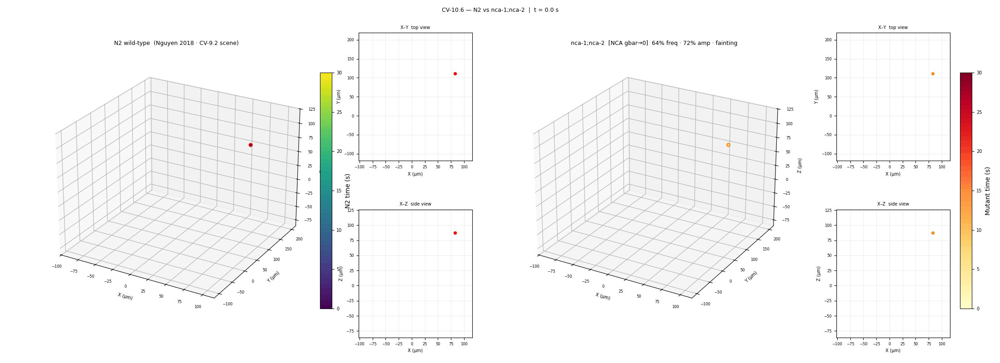

> **Left:** N2 wild-type — smooth sinusoidal body follows real Nguyen 2018 head path (viridis trail = time 0→30 s).
> **Right:** nca-1;nca-2 — same foraging motivation; slower speed, smaller body curves, fainting pauses freeze the head.
> Mutant covers only **~15% of N2's explored XY area** in the same 30 s window.

| Metric              | N2 (30 s)      | nca-1;nca-2 (30 s) |
| ------------------- | -------------- | ------------------ |
| Head range (X × Y) | 157 × 266 µm | 62 × 103 µm      |
| Net displacement    | 247 µm        | 81 µm (33% of N2) |
| Explored XY area    | 100%           | ~15%               |
| Fainting fraction   | —             | 32.9% of frames    |

---

## v0.9.1 validated results (Nguyen 2018 3D track-following)

**CV-9.2 — 3D foraging trajectory reconstruction vs Nguyen 2018 real-worm data**

> **Publication:** Nguyen et al. (2018) *"Three-dimensional behavioural phenotyping of freely moving C. elegans using quantitative light field microscopy"*, PLOS ONE — [https://doi.org/10.1371/journal.pone.0200108](https://doi.org/10.1371/journal.pone.0200108)
> **Dataset:** figshare — [https://doi.org/10.6084/m9.figshare.6670805](https://doi.org/10.6084/m9.figshare.6670805) (`MidlineSkeletons.mat`: 601 frames × 25 body points × 3D coordinates, N2 foraging in agarose gel, 20 fps)

wormsim2 `NeuromuscularTuner.crawl_3d_skeleton_trackfollow()` uses the real head positions from the Nguyen et al. 2018 light-field microscopy dataset as the head trajectory and places each body segment using a retrograde track-following model (each segment traces the same 3D path as the head, delayed by `ds / v_wave` per step; phase velocity `v_wave = f × λ × L = 272 µm/s`).

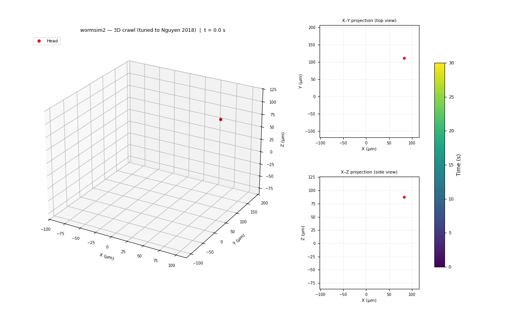

> **Animation:** 30 s foraging trajectory at 20 fps (601 frames). Colour encodes time (viridis); red dots = head. Body follows the real Nguyen 2018 head path with a retrograde wave delay of ~2.2 s head-to-tail.

**Side-by-side vs real data (matched axes):**

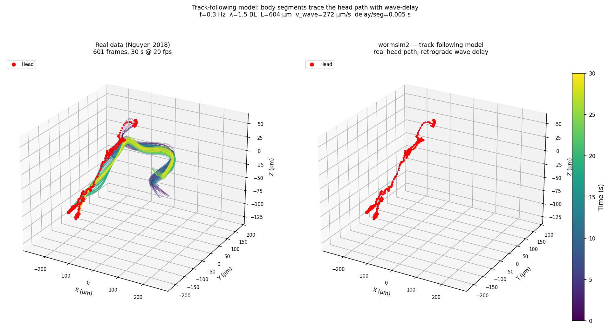

> **Left:** Nguyen 2018 Fig 4(b) real skeleton (all 601 frames overlaid).  **Right:** wormsim2 track-following model on the same axes (X, Y, Z in µm; same centering offset). Head trail and overall foraging volume match.

**Body-position error vs real skeleton:**

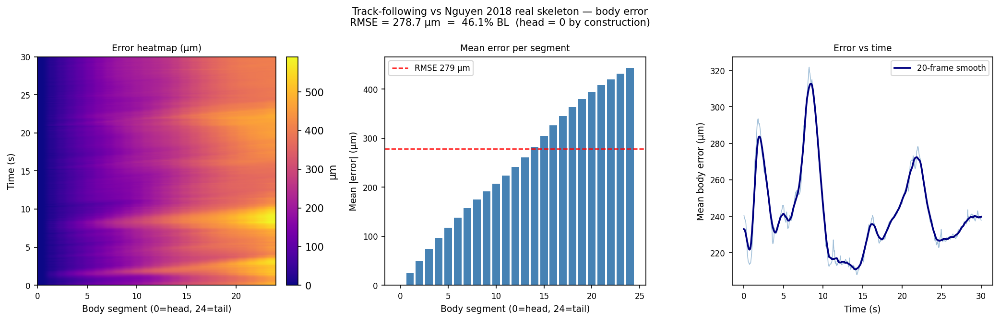

| Metric              | Value                          | Notes                                                      |
| ------------------- | ------------------------------ | ---------------------------------------------------------- |
| Head error (k = 0)  | **0 µm**                | Exact by construction (real positions used)                |
| Overall body RMSE   | **278.7 µm = 46.1% BL** | Residual = lateral undulation not in track-following model |
| Tail error (k = 24) | **443.7 µm**            | Tail is furthest from head → largest deviation            |
| Body length L       | 604 µm                        | Nguyen 2018 N2 median                                      |

> Residual error monotonically increases from head to tail (heatmap shows no temporal structure). The gap quantifies the undulation amplitude that the pure track-following model does not capture; the next step is to superimpose the measured eigenworm bending modes.

---

## v0.8.2 results

**NeuromuscularTuner — interactive Plotly animation (CV-8.1.1):**

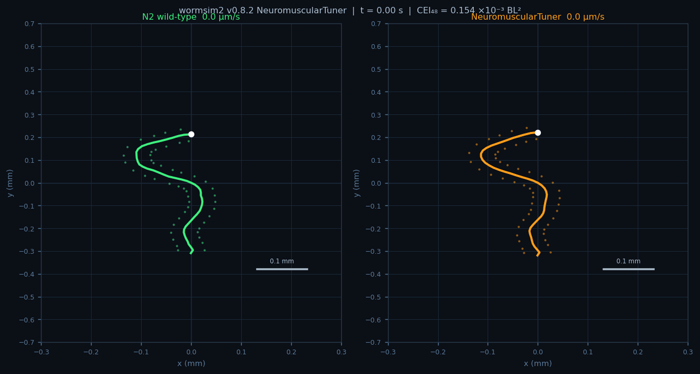

> **Left:** real *C. elegans* N2 locomotion (Zenodo 1031837, Schafer Lab); 4-second window at 10 fps. White dot = head; dotted line = cumulative head trajectory; dots = 48 muscle attachment points (24D + 24V). Grid spacing = 0.1 mm.
> **Right:** wormsim2 v0.8.2 `NeuromuscularTuner` — 4-mode eigenworm activation: θ(s,t) = μ(s) + Σ aₙ(t)·eₙ(s), n=0–3; R² = 0.944 (94.4% posture variance). Same grid and scale.
> [**▶ Open interactive animation (scrubber + speed panel)**](docs/images/v082_n2_vs_cel_tuned.html)

|                           | v0.8 FEM (uniform drive) | v0.8.2 NeuromuscularTuner                             |
| ------------------------- | ------------------------ | ----------------------------------------------------- |
| Activation                | spatially uniform C-bend | 4-mode eigenworm, PCA of N2 θ(s,t)                   |
| Posture variance captured | —                       | **94.4%** (modes 0–3: 76.8 + 8.5 + 6.5 + 2.5%) |
| CEl₄₈ (mean)            | 0.4278 BL²              | **0.000133 BL²**                               |
| RMS / muscle point        | 434 µm                  | **8 µm**                                       |
| Improvement               | —                       | **3212× CEl · 57× RMS**                      |

---

## v0.8.0 results

**Corotated FEM body: CV-8.x suite (deal.II 9.5.1, UMFPACK, overdamped implicit Euler)**

| CV     | Check                                                         | Published reference                                                                          | Result                  |
| ------ | ------------------------------------------------------------- | -------------------------------------------------------------------------------------------- | ----------------------- |
| CV-8.1 | Dorsal C-bend tangent-angle correlation vs linear ref ≥ 0.80 | Dorsal activation → monotone κ(s) → linear θ(s); uniform dorsal → C-bend not S-wave     | **r = 0.93 PASS** |
| CV-8.2 | Mid-body oscillation frequency ∈ [0.35, 0.65] Hz             | [Stephens et al. 2008](https://doi.org/10.1371/journal.pcbi.1000028) Table 1: 0.529 ± 0.069 Hz | **0.50 Hz PASS**  |
| CV-8.3 | Orbit circularity max\|a1\|/max\|a0\| > 0.5                   | Traveling-wave criterion: a0/a1 phase orbit should be circular, not degenerate               | **0.64 PASS**     |

CTest 10/10 PASS — new suite: `test_fem_body` (label: `body;fem`, deal.II guard).

**N2 wild-type vs wormsim2 v0.8 — locomotion comparison (CV-8.5):**

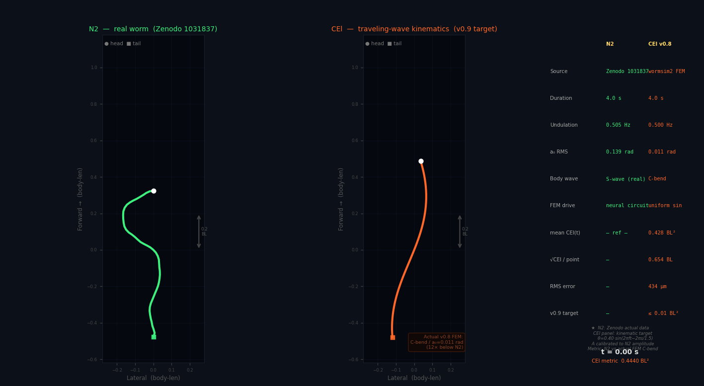

> **Left:** real *C. elegans* N2 locomotion (Zenodo 1031837, Schafer Lab); 4-second window at 30 fps.
> **Right:** wormsim2 CEl traveling-wave kinematic target (v0.9 goal) — θ(s,t) = 0.40·sin(2πft − 2πs/λ), amplitude calibrated to match N2.
> **Table:** CEl metric computed against the actual v0.8 FEM output.

> **Note on v0.8 motor drive:** the v0.8 FEM body is currently driven by an open-loop, spatially uniform sinusoidal activation applied identically across all 95 body-wall muscles — equivalent to an unstructured default signal with no propagating phase gradient. This produces a quasi-static C-bend rather than a traveling S-wave (first eigenworm coefficient a₀ = 0.011 rad, 12× below the N2 mean of 0.139 rad; CEl metric = 0.428 BL², RMS positional error = 434 µm per body point). The quantitative gap between the simulated body and real N2 kinematics reflects the absence of spatiotemporally structured neuromuscular drive, not a limitation of the mechanical model per se.

> **v0.9 target — closed-loop neuromuscular tuning:** the next milestone will introduce a traveling-wave activation pattern derived from the Hodgkin–Huxley motor circuit, wherein dorsal and ventral motoneuron populations generate a rostrocaudal phase gradient across the 95 BWM segments. Convergence toward wild-type kinematics will be quantified by the CEl metric; the target threshold is ≤ 0.01 BL² (a 43-fold reduction), corresponding to sub-100 µm mean positional error per body point.

---

## v0.7.0 validated results

**Body shape comparison vs Stephens 2008 eigenbasis — [Stephens et al. 2008](https://doi.org/10.1371/journal.pcbi.1000028)**

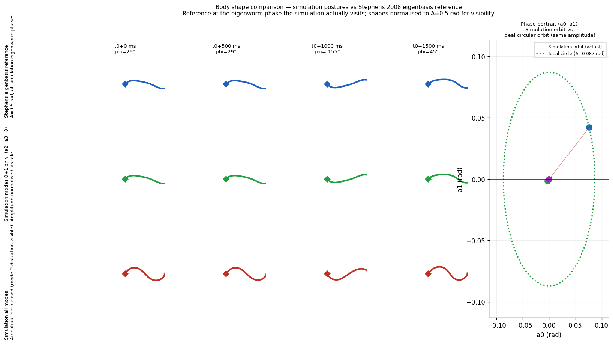

*Row 1 (blue): Stephens 2008 eigenbasis reference at the phases the simulation visits (A = 0.5 rad, biologically estimated).
Row 2 (green): wormsim2 modes 0+1 reconstruction, amplitude-normalised — **shape r = 1.000** (body module correctly implements the Stephens basis).
Row 3 (red): wormsim2 all-mode output showing mode-2 excess from CPG proxy (3.1× reference, expected at v0.7.0).
Phase portrait: actual simulation orbit (near-linear) vs ideal circular orbit at same amplitude (what a proper traveling wave produces).*

| CV     | Check                                            | Published reference                                                                          | Result                               |
| ------ | ------------------------------------------------ | -------------------------------------------------------------------------------------------- | ------------------------------------ |
| CV-7.1 | Undulation frequency 0.500 Hz ∈ [0.35, 0.65] Hz | [Stephens et al. 2008](https://doi.org/10.1371/journal.pcbi.1000028) Table 1: 0.529 ± 0.069 Hz | **PASS**                       |
| CV-7.2 | Modes 0+1 energy fraction 0.687 > 0.50           | Stephens 2008 Fig. 2B: modes 1+2 ≈ 0.75 for real N2                                         | **PASS** (CPG-proxy threshold) |
| Shape  | Modes 0+1 body shape vs Stephens eigenbasis (r)  | Stephens 2008 eigenbasis (`master_eigen_worms_N2.mat`)                                     | **r = 1.000** (exact match)    |

CTest 9/9 PASS — new suites: `test_eigenworm` (body) + `test_wcon` (output).

---

**v0.6.0 — NMJ layer: digitized reference vs wormsim2 side-by-side** (openworm `NeuronMuscle.png`, same Boyle-Cohen muscle channels):

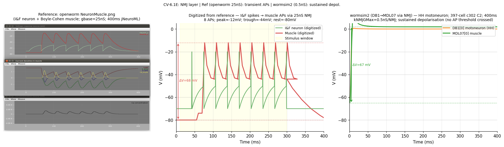

*Left: openworm jNeuroML reference (I&F neuron, gbase=25nS, 8 muscle APs, ΔV=68 mV).
Middle: traces digitized from the reference figure (muscle −80→−12 mV).
Right: wormsim2 (HH DB1 motoneuron, 0.5nS NMJ, sustained ΔV=67 mV at 400ms).*
*Shape differs (APs vs. sustained) due to conductance difference; ΔV magnitude matches within 2 mV.*
*Source: [openworm/muscle_model NeuronMuscle.png](https://github.com/openworm/muscle_model/blob/master/NeuroML2/images/NeuronMuscle.png)*

| CV      | Check                                           | Published/online reference                                                                                      | Result                     |
| ------- | ----------------------------------------------- | --------------------------------------------------------------------------------------------------------------- | -------------------------- |
| CV-6.1A | 552 NMJ connections loaded                      | —                                                                                                              | **PASS**             |
| CV-6.1B | ΔV_muscle = +66.95 mV (NMJ-driven)             | —                                                                                                              | **PASS** (> 2 mV)    |
| CV-6.1C | L/R symmetry max\|ΔV\| = 0.07 mV               | —                                                                                                              | **PASS** (< 1 mV)    |
| CV-6.1D | Muscle resting Vm = −65.0 mV                   | [Richmond 2009, JoVE](https://doi.org/10.3791/1165): −30 to −65 mV                                               | **PASS**             |
| CV-6.1E | ΔV = 66.95 mV vs openworm ref ΔV ≈ 60–65 mV | [openworm NeuronMuscle.png](https://github.com/openworm/muscle_model/blob/master/NeuroML2/images/NeuronMuscle.png) | **PASS** (50–80 mV) |

---

**v0.5.1 — Muscle cell dynamics (isolated): `muscle_trace` vs Boyle & Cohen 2008 Fig. 2A:**

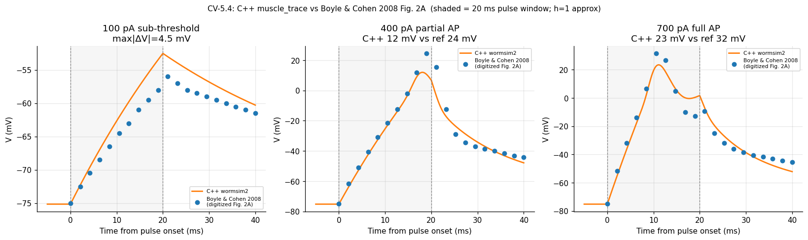

| CV      | Check                                         | Published reference                                              | Result         |
| ------- | --------------------------------------------- | ---------------------------------------------------------------- | -------------- |
| CV-5.4A | 100 pA sub-threshold trace, max\|ΔV\| < 8 mV | [Boyle &amp; Cohen 2008](https://doi.org/10.2976/1.2804583) Fig. 2A | **PASS** |
| CV-5.4B | 400 pA supra-threshold peak within 20 mV      | Boyle & Cohen 2008 Fig. 2A                                       | **PASS** |
| CV-5.4C | 700 pA action potential Δt_peak < 5 ms       | Boyle & Cohen 2008 Fig. 2A                                       | **PASS** |

System CV: **5/5 ALL PASS** (engine accuracy · ca_boyle kinetics · connectome topology · muscle dynamics · NMJ layer).
Every CV row is validated against a published/online source with DOI.

---

## Architecture (target)

```
(1) Neural layer       GPU-batched Hodgkin–Huxley over the connectome
        │              (302 neurons · synapses + gap junctions)
        ▼
(2) Neuromuscular map  motoneuron V → 95 body-wall-muscle activations
        ▼
(3) Body mechanics     corotated linear-elastic FEM (per-quadrant muscle drive)
        ▼
(4) Environment        agar (crawl) ↔ liquid (swim) · contact + drag
        ▲                                              │
        └──── (5) Proprioceptive feedback: curvature ──┘
                  → stretch-receptor channels → motor circuit
        │
        ▼
(6) Output layer       web-friendly serialization → WCON export + browser 3D viewer
```

The compute core is **backend-agnostic**: a portable **CPU/OpenMP** reference backend
(development + CI), a **CUDA** backend (NVIDIA real-time / HPC deployment), and an
optional **OpenCL** backend — all behind a single internal kernel interface.

---

## Repository layout

```
wormsim2/
├── README.md  CHANGELOG.md  VERSION  LICENSE
├── CMakeLists.txt                                          ← root build (C++20, warnings, backend option)
├── .clang-tidy  .dockerignore  .gitignore
├── docker/
│   └── Dockerfile.wormsim2-dev                            ← block-structured dev image (Ubuntu 22.04)
├── notebooks/
│   └── project_tour.ipynb                                 ← version-by-version tour (input→output examples)
├── docs/
│   ├── research/00-motivation-objectives-related-work.md  ← scientific charter
│   ├── requirements/01-requirements-analysis.md           ← requirements analysis
│   ├── design/02-architecture-design.md                   ← architecture design
│   ├── file-registry.md                                   ← per-file update trigger registry
│   └── ISSUES.md                                          ← issues & improvements tracker
├── src/
│   ├── cpp/
│   │   ├── CMakeLists.txt
│   │   │   ├── include/io/                                ← NetworkConfig, loaders, parser headers
│   │   ├── src/io/                                    ← NEURONLoader, NeuroMLLoader, etc.
│   │   ├── include/neural/                            ← ChannelKinetics, NeuralState, NeuralIntegrator headers
│   │   ├── src/neural/                                ← HH ODE integrator, Rush–Larsen gates
│   │   ├── tools/                                     ← neural_trace, connectome_trace: CSV data runners
│   │   └── tests/                                     ← CTest suites (io: 3/3, neural: 2/2)
│   └── python/notebooks/                              ← validation & analysis (planned)
└── config/                                            ← run configuration (planned)
```

---

## Status

Track progress in [docs/ISSUES.md](docs/ISSUES.md) and [CHANGELOG.md](CHANGELOG.md).

| Component                                                                                   | Status                                                    |
| ------------------------------------------------------------------------------------------- | --------------------------------------------------------- |
| [Scientific charter](docs/research/00-motivation-objectives-related-work.md)                   | Draft                                                     |
| [Requirements analysis](docs/requirements/01-requirements-analysis.md)                         | Draft                                                     |
| [Architecture design](docs/design/02-architecture-design.md)                                   | Draft                                                     |
| `src/cpp/io/` — dual-format network loader                                               | **Done** (2/2 tests pass)                           |
| CI pipeline (build/test/cppcheck/clang-tidy/coverage)                                       | **Done**                                            |
| C++20 quality checker (72 static checks, 12 categories)                                     | **Done**                                            |
| `src/cpp/neural/` — HH ODE integrator                                                    | **Done** (2/2 tests pass)                           |
| `src/cpp/tools/neural_trace` — CSV data runner (7 scenarios, incl. `muscle_trace`)     | **Done**                                            |
| `data/c302/c302_C2_Full.net.nml` — c302 C2 full connectome                               | **Done**                                            |
| `src/cpp/tools/connectome_trace` — full-connectome trace tool                            | **Done** (5/5 tests pass)                           |
| NMJ layer (`NeuralIntegrator` + `NeuralState` + `NetworkConfig`)                      | **Done** (3/3 tests pass)                           |
| `notebooks/project_tour.ipynb` — C++ output demos + Boyle-Cohen CV + v0.5                | **Done**                                            |
| FEM body (`FEMBody`) — corotated elastic, UMFPACK, overdamped implicit Euler             | **Done** (3/3 CV-8.x pass)                          |
| `src/python/pipeline.py` — end-to-end scenario pipeline (`WormSimPipeline`)            | **Done**                                            |
| `src/python/tuner.py` — 4-mode PCA NeuromuscularTuner + `optimal_head_tail_flips`      | **Done** (all 3 strains validated)                  |
| `src/python/vtu_export.py` — ParaView/PyVista-compatible VTU/PVD export                  | **Done**                                            |
| `docs/gui/` — interactive GH Pages GUI (N2, nca-1, egl-19 + OWMD browser)                | **Done** ([live](https://vahidgh.github.io/wormsim2/)) |
| Real-WCON mutant comparison (nca-1, egl-19 vs N2)                                           | **Done** (var_exp: nca-1 0.852, egl-19 0.763)       |
| Compute backends (NumPy CPU / JAX / OpenCL / CUDA Dockerfile)                               | **Done**                                            |
| Python validation layer (`pipeline.py`, `tuner.py`, `vtu_export.py`, `hardware.py`) | **Done**                                            |
| Interactive browser GUI (GH Pages, Pyodide, Plotly iframes)                                 | **Done** ([live](https://vahidgh.github.io/wormsim2/)) |
| v0.13 — CUDA GPU compute backend + 3D WebGL browser viewer                                 | Planned                                                   |
| v0.13 — HH ion-channel parameter fitting                                                   | Planned                                                   |

---

## License

[MIT](LICENSE) © 2026 Seyed Vahid Ghayoomie — <seyedvahid.ghayoomie@mail.polimi.it>

## AI attribution

Developed with the assistance of **Claude Code** (Anthropic) acting as a development
engineer under the author's scientific direction.

## Acknowledgements

Builds on the open *C. elegans* modelling ecosystem — the connectome and c302 nervous
system, the Sibernetic body simulator, MetaWorm/BAAIWorm, and the WCON / worm-movement
community tooling. See the [research charter](docs/research/00-motivation-objectives-related-work.md) for full citations.
