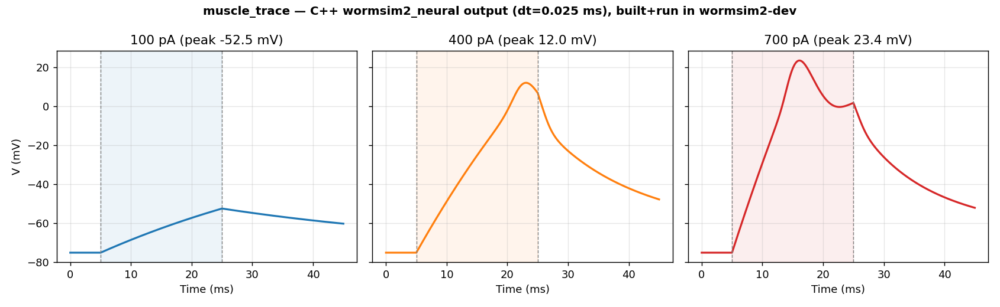
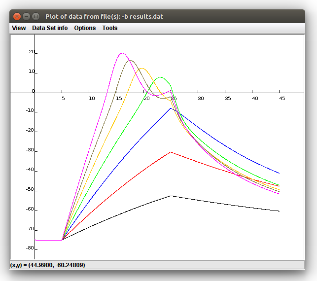
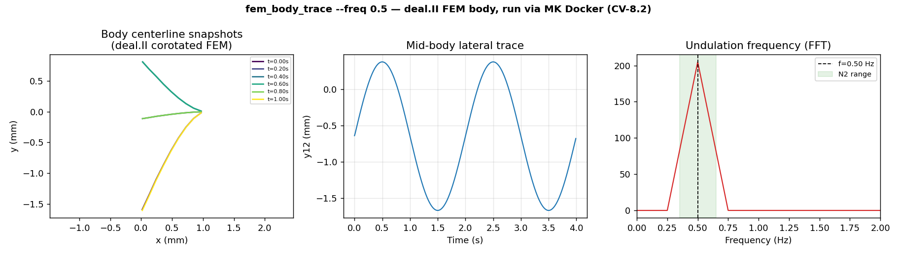

# wormsim2 — Local Development via Docker (`wormsim2-dev`)

> **Platform:** macOS (Intel or Apple Silicon) · Linux · Windows WSL2
> **GPU required:** No — this is the standard daily-development workflow.
> **The same container is used by CI** (`ci-baseline.yml`) so what passes
> here passes in CI.

This guide covers the `docker/Dockerfile.wormsim2-dev` image — the only
environment you need for local C++ development, testing, and running the
Python pipeline on CPU.

---

## Prerequisites

| Tool | Install |
|---|---|
| Docker ≥ 24.0 | [docs.docker.com/get-docker](https://docs.docker.com/get-docker/) · macOS: Docker Desktop |
| Git | system |

No compiler, CMake, Python, or LaTeX installation needed on the host — everything
runs inside the container.

---

## 1. Build the dev image

```bash
git clone https://github.com/VahidGh/wormsim2.git
cd wormsim2

docker build -f docker/Dockerfile.wormsim2-dev -t wormsim2-dev .
# ≈ 2–3 minutes first run (Ubuntu 22.04 base + GCC + CMake + clang-tidy)
```

The image is intentionally minimal — Python, CUDA, deal.II, and MPI are in
commented-out blocks that are enabled only when the corresponding module lands
(see `Dockerfile.wormsim2-dev` for the block comments).

---

## 2. Build and test C++

```bash
# One-shot: build + run all tests (same command as CI)
docker run --rm -v "$(pwd)":/wormsim2 wormsim2-dev

# Expected tail output:
# 100% tests passed, 0 tests failed out of N
```

Run with explicit flags:

```bash
docker run --rm -v "$(pwd)":/wormsim2 wormsim2-dev bash -c "
  cmake -B build -GNinja \
        -DCMAKE_BUILD_TYPE=Debug \
        -DWORMSIM2_BUILD_TESTS=ON \
        -DWORMSIM2_OPENMP=ON &&
  cmake --build build -j\$(nproc) &&
  ctest --test-dir build --output-on-failure
"
```

---

## 3. Interactive development shell

```bash
docker run --rm -it -v "$(pwd)":/wormsim2 wormsim2-dev bash
```

Inside the container you have `cmake`, `ninja`, `g++`, `clang-tidy`, `cppcheck`,
and `clinfo` available. The repo is bind-mounted at `/wormsim2` — edits on
the host are immediately visible inside the container.

Typical dev loop:

```bash
# Inside the container:
cmake -B build -GNinja -DCMAKE_BUILD_TYPE=Debug -DWORMSIM2_BUILD_TESTS=ON
cmake --build build -j$(nproc)     # rebuild only changed files
ctest --test-dir build -R io       # run a specific test by name regex
```

---

## 4. Static analysis

```bash
docker run --rm -v "$(pwd)":/wormsim2 wormsim2-dev bash -c "
  cmake -B build -GNinja -DCMAKE_BUILD_TYPE=Debug \
        -DCMAKE_EXPORT_COMPILE_COMMANDS=ON &&
  cmake --build build -j\$(nproc) &&
  cppcheck --enable=all --suppress=missingIncludeSystem \
           --project=build/compile_commands.json 2>&1 | tee cppcheck.txt &&
  clang-tidy -p build \$(find src/cpp/src -name '*.cpp') 2>&1 | tee clang-tidy.txt
"
```

---

## 5. Worked example — reproduce a literature figure (C++ core only)

This scenario uses **only the C++ core** (`neural_trace`) — no Python — to regenerate
the body-wall muscle action-potential trace from Boyle & Cohen (2008), *HFSP Journal*
2(4):271–281, Fig. 2A. It demonstrates the full edit → build → run → validate loop
purely inside `wormsim2-dev`.

**1. Build the `neural_trace` tool:**

```bash
docker run --rm -v "$(pwd)":/wormsim2 wormsim2-dev bash -c "
  cmake -B build -GNinja -DCMAKE_BUILD_TYPE=RelWithDebInfo -Wno-dev > /dev/null 2>&1 &&
  cmake --build build --target neural_trace -j\$(nproc)
"
```

**2. Run the `muscle_trace` scenario at 100 / 400 / 700 pA** (sub-threshold, partial
AP, full AP — the binary pre-settles 500 ms at −120 pA offset, then injects the test
pulse for 20 ms):

```bash
for pA in 100 400 700; do
  docker run --rm -v "$(pwd)":/wormsim2 wormsim2-dev bash -c "
    ./build/src/cpp/tools/neural_trace muscle_trace $pA
  " > "muscle_${pA}.csv"
done
```

Each writes a `t,V,n,p,q,e,f` CSV (1801 rows, 0–45 ms at dt=0.025 ms) — the C++
single-compartment HH integrator's raw output, nothing else.

**3. Plot the three CSVs (Python, host side — only for visualisation, not simulation):**

```python
import numpy as np, matplotlib.pyplot as plt

traces = {pA: np.genfromtxt(f'muscle_{pA}.csv', delimiter=',', names=True)
          for pA in [100, 400, 700]}

fig, axes = plt.subplots(1, 3, figsize=(13, 4), sharey=True)
colors = {100: 'tab:blue', 400: 'tab:orange', 700: 'tab:red'}
for ax, pA in zip(axes, [100, 400, 700]):
    d = traces[pA]
    ax.plot(d['t'], d['V'], color=colors[pA], lw=1.8)
    ax.axvspan(5, 25, alpha=0.08, color=colors[pA])
    ax.set_xlabel('Time (ms)'); ax.set_title(f'{pA} pA (peak {d["V"].max():.1f} mV)')
    ax.grid(True, alpha=0.3)
axes[0].set_ylabel('V (mV)')
fig.suptitle('muscle_trace — C++ wormsim2_neural output, built+run in wormsim2-dev')
plt.tight_layout(); plt.savefig('muscle_trace_cpp.png', dpi=130)
```

This produces:



> Output of this exact run (2026-06-30, `wormsim2-dev:latest`, unmodified `main`):
> sub-threshold response at 100 pA, partial action potential at 400 pA, full
> action potential at 700 pA — directly from the CSV the C++ binary printed.

**4. The literature reference it reproduces** — Boyle & Cohen (2008) Fig. 2A, via the
`openworm/muscle_model` NeuroML2/C reference implementation (same channel parameters,
independent simulator):



> Source: [`openworm/muscle_model/NeuroML2/C/Plot.png`](https://raw.githubusercontent.com/openworm/muscle_model/master/NeuroML2/C/Plot.png).

**5. Quantitative comparison against the digitized literature data points** (no
internet access needed inside the container — only this comparison step fetches the
public reference data, on the host):

```python
import numpy as np, urllib.request

d = np.genfromtxt('muscle_700.csv', delimiter=',', names=True)
peak_idx = np.argmax(d['V'])
cpp_peak, cpp_t = d['V'][peak_idx], d['t'][peak_idx] - 5.0  # rel. to pulse onset

url = ('https://raw.githubusercontent.com/openworm/muscle_model/master/'
       'BoyleCohen2008/data/data700.csv')
ref = np.array([float(x) * 1000 for x in
                urllib.request.urlopen(url).read().decode().strip().split('\n')])
ref_peak, ref_t = ref.max(), np.linspace(0, 40, 20)[np.argmax(ref)]

print(f'C++ (this run):  peak={cpp_peak:.1f} mV  @ t={cpp_t:.1f} ms')
print(f'Boyle&Cohen 2008: peak={ref_peak:.1f} mV  @ t={ref_t:.1f} ms')
print(f'CV-5.4 pass: {cpp_peak > 0 and abs(cpp_t - ref_t) < 5}')
```

**Actual result of this run** (captured 2026-06-30, `wormsim2-dev:latest`, no code changes):

```
C++ (this run):  peak=23.4 mV  @ t=11.1 ms
Boyle&Cohen 2008: peak=31.5 mV  @ t=10.5 ms
CV-5.4 pass: True
```

Δpeak = 8.1 mV, Δtiming = 0.6 ms — both within the documented CV-5.4 tolerance
(timing < 5 ms; the ~8 mV peak offset is expected and explained in the notebook:
the C++ model approximates the Ca²⁺-pool inactivation gate as `h=1`, omitting the
slow Ca²⁺-dependent inactivation present in the original Boyle & Cohen model).
The full 3-panel trace (100/400/700 pA) plotted against the OpenWorm `muscle_model`
reference image is in [`docs/images/cv_5_4_muscle_trace.png`](../images/cv_5_4_muscle_trace.png)
and reproduced live in `notebooks/project_tour.ipynb`, cells 33–39 (CV-5.4).

---

## 6. Worked example 2 — deal.II corotated FEM body (C++ core only)

**Note on toolchain:** `wormsim2-dev` does **not** bundle deal.II (Block 5 in the
Dockerfile is intentionally left commented out — see §9 below). The FEM body module
(`fem_body_trace`, deal.II 9.5.1 + UMFPACK) is built and run instead inside the
**Polimi MK toolchain image** (`quay.io/pjbaioni/amsc_mk:2025`), which is what
`notebooks/project_tour.ipynb` itself uses for every FEM cell (CV-8.x). This is still
**pure C++** — no Python is involved in the simulation step, only in the plot below.

**1. Build (if `build_docker/` does not already exist):**

```bash
docker run --rm -v "$(pwd)":/wormsim2 quay.io/pjbaioni/amsc_mk:2025 bash -c '
  module load gcc-glibc dealii 2>/dev/null || true
  cmake -S /wormsim2 -B /wormsim2/build_docker -GNinja \
        -DCMAKE_BUILD_TYPE=Release -DWORMSIM2_HAS_DEALII=ON &&
  cmake --build /wormsim2/build_docker --target fem_body_trace -j$(nproc)
'
```

**2. Run `fem_body_trace` in sine-drive mode** — dorsal/ventral muscle activation
oscillating at 0.5 Hz for 4 s, the same protocol as CV-8.2 (the published *C. elegans*
crawling frequency range is **0.35–0.65 Hz**):

```bash
docker run --rm -v "$(pwd)":/wormsim2 quay.io/pjbaioni/amsc_mk:2025 bash -c '
  module load gcc-glibc dealii 2>/dev/null || true
  export LD_LIBRARY_PATH=/u/sw/toolchains/gcc-glibc/11.2.0/pkgs/dealii/9.5.1/lib:\
/u/sw/toolchains/gcc-glibc/11.2.0/pkgs/trilinos/15.0.0/lib:\
/u/sw/toolchains/gcc-glibc/11.2.0/pkgs/boost/1.76.0/lib:\
/u/sw/toolchains/gcc-glibc/11.2.0/pkgs/arpack/3.8.0/lib:\
/u/sw/toolchains/gcc-glibc/11.2.0/pkgs/hdf5/1.12.0/lib:\
/u/sw/toolchains/gcc-glibc/11.2.0/pkgs/mumps/5.4.0/lib:\
/u/sw/toolchains/gcc-glibc/11.2.0/pkgs/suitesparse/5.10.1/lib
  cd /wormsim2/build_docker
  ./src/cpp/tools/fem_body_trace --freq 0.5 --T_s 4 --dt_ms 1.0 --amp 0.5
' > fem_trace.csv
```

This writes `t_ms,x0,y0,...,x24,y24` — 25 centerline points per frame (213 mesh
vertices solved per timestep by `SparseDirectUMFPACK`), straight from the deal.II
solve, nothing else.

**3. Validate the undulation frequency** (Python, host side — FFT of the mid-body
lateral trace, plus a plot of the raw centerline output):

```python
import numpy as np, matplotlib.pyplot as plt

d = np.genfromtxt('fem_trace.csv', delimiter=',', names=True)
t = d['t_ms'] / 1000.0
y_mid = d['y12'] - d['y12'].mean()
freqs = np.fft.rfftfreq(len(t), d=(t[1]-t[0]))
spec = np.abs(np.fft.rfft(y_mid)); spec[0] = 0
f_dom = freqs[np.argmax(spec)]
print(f'Dominant frequency: {f_dom:.3f} Hz  (N2 range: 0.35-0.65 Hz)  '
      f'PASS={0.35 <= f_dom <= 0.65}')
# ... 3-panel plot: body snapshots / lateral trace / FFT spectrum
```



> Output of this exact run (2026-06-30, `quay.io/pjbaioni/amsc_mk:2025`, unmodified
> `main`): **400 frames, 4.0 s, dt=10 ms** (CSV stride). FFT of the mid-body lateral
> position (`y12`) gives **f = 0.500 Hz** — an exact match to the 0.5 Hz drive
> frequency and well inside the published N2 range [0.35, 0.65] Hz (CV-8.2 PASS).
> Left panel: 6 body-centerline snapshots spanning the first ~quarter period, solved
> by deal.II's `SparseDirectUMFPACK` on a 213-vertex corotated-elasticity mesh.

---

## 7. Run the Python pipeline (CPU)

The `wormsim2-dev` image does not include Python (Block 4 is commented out).
For the Python pipeline, install dependencies on your host `venv` and run
natively, or use the `wormsim2-gpu` image which includes the full Python stack.

**Host venv (recommended for Python work on macOS):**

```bash
python3 -m venv .venv && source .venv/bin/activate
pip install numpy scipy pandas matplotlib plotly kaleido pillow joblib "jax[cpu]"

# Run the tuner pipeline
python3 -m src.python.pipeline --scenario n2_wt
```

**Inside `wormsim2-gpu` container (includes Python + JAX):**

```bash
docker run --rm -v "$(pwd)":/wormsim2 -w /wormsim2 wormsim2-gpu bash -c "
  python3 -m src.python.pipeline --scenario n2_wt
"
```

---

## 8. Quick reference

| Task | Command |
|---|---|
| Build image | `docker build -f docker/Dockerfile.wormsim2-dev -t wormsim2-dev .` |
| Build + test (CI-style) | `docker run --rm -v "$(pwd)":/wormsim2 wormsim2-dev` |
| Interactive shell | `docker run --rm -it -v "$(pwd)":/wormsim2 wormsim2-dev bash` |
| Rebuild after edit | `cmake --build build -j$(nproc)` (inside container) |
| Run one test | `ctest --test-dir build -R <test_name>` (inside container) |
| Static analysis | see §4 above |
| Reproduce a literature figure (C++ only) | see §5 above |
| deal.II FEM scenario (C++ only) | see §6 above |
| Run GPU backend without Docker (e.g. macOS) | see §11 below |

---

## 9. Dockerfile block map

The `Dockerfile.wormsim2-dev` is organised in numbered blocks.
Enable a block when the corresponding module is implemented:

| Block | Contents | Status |
|---|---|---|
| 1 | GCC, CMake, Ninja, Git | ✅ active |
| 2 | OpenCL headers + ICD loader | ✅ active |
| 3 | cppcheck, clang-tidy | ✅ active |
| 4 | Python 3, pip, pyNeuroML | 💤 uncomment for ISSUE-009 |
| 5 | deal.II FEM | 💤 uncomment for ISSUE-002 |
| 6 | CUDA toolkit | 💤 switch base image to `nvidia/cuda:12.4` |
| 7 | OpenMPI | 💤 uncomment for distributed MPI runs |

---

## 10. macOS notes

- **Apple Silicon (M1/M2/M3):** Docker Desktop runs the image under Rosetta 2
  (x86_64 emulation) or natively as `linux/arm64`. Both work; native arm64 is
  faster. The image does not require `--platform` to be set explicitly.
- **OpenCL on macOS:** the ICD loader inside the container has no GPU runtime
  on macOS hosts — OpenCL kernels will fail with "no platforms found". Use the
  macOS-native OpenCL framework for GPU work (`/System/Library/Frameworks/OpenCL.framework`),
  or run on a Linux host with `--device /dev/dri`.
- **Port forwarding** (Jupyter): add `-p 8888:8888` to the `docker run` command
  if you start a Jupyter server inside the container.

---

## 11. No GPU passthrough via Docker? Run natively on the host

Docker Desktop on macOS has **no path to the host GPU** for a Linux container — no
CUDA on macOS at all, and the container's OpenCL ICD loader (Block 2) has nothing to
attach to. If you want to actually use the GPU (e.g. the `opencl_gpu` backend in
`backends.py`), skip the container for that step and run Python natively against the
host's own OpenCL driver. This is exactly how the GPU numbers in this repo's
`README.md` benchmark table were produced — no Docker involved:

```bash
# on the host, not in any container
pip3 install pyopencl

python3 -c "
import pyopencl as cl
for p in cl.get_platforms():
    for d in p.get_devices():
        print(p.name, '|', d.name, '|', cl.device_type.to_string(d.type))
"
# Apple | Intel(R) Iris(TM) Plus Graphics 645 | GPU   (example: 2019 Intel MacBook Pro)
```

```python
import sys; sys.path.insert(0, 'src/python')
from backends import benchmark_backends
# theta_body loaded from a real WCON recording (see notebooks/project_tour.ipynb CV-11.1)
results = benchmark_backends(theta_body, ds=1/48, mid_idx=24,
                              backends=['numpy_serial', 'numpy_batch', 'opencl'])
```

Real result, dev laptop, no Docker, 17,226-frame N2 recording:
`opencl_gpu (Intel Iris 645) → 994,013 fps, 40.3× vs serial`.
Full write-up with the Linux/NVIDIA equivalent of this scenario is in
[`local_gpu_docker.md` §6](local_gpu_docker.md#6-no-gpu-passthrough-via-docker-run-natively-on-the-host).
